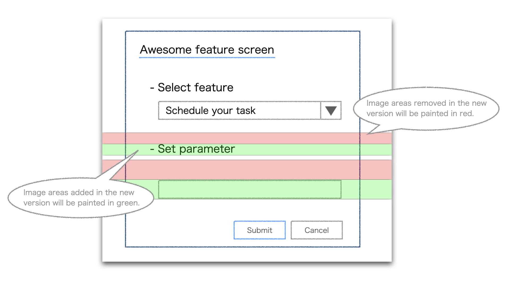

# imgdiff

[](https://opensource.org/licenses/MIT) [](https://circleci.com/gh/kemokemo/imgdiff)

This tool compares old and new versions of image files and generates color-coded image in a diff format.



This is based on the [diff-image](https://github.com/murooka/go-diff-image/blob/master/cmd/diff-image/main.go).
Thanks to the wonderful [@murooka](https://github.com/murooka)'s [go-diff-image](https://github.com/murooka/go-diff-image).

## Install

### Binary

Get the latest version from [the release page](https://github.com/kemokemo/imgdiff/releases/latest), and download the archive file for your operating system/architecture. Unpack the archive, and put the binary somewhere in your `$PATH`.

## Usage

```sh
$ imgdiff -h
Usage: imgdiff [<option>...] <old image> <new image>
  -h display help
  -o string
    	output filename (default "diff.png")
```

### Example

```sh
imgdiff -o=diff/screen.png v1/screen.png v2/screen.png
```

This tool supports the following image formats.

- png
- jpeg
- gif
- bmp

## License

[MIT](https://github.com/kemokemo/imgdiff/blob/master/LICENSE)

## Authors

[kemokemo](https://github.com/kemokemo)
